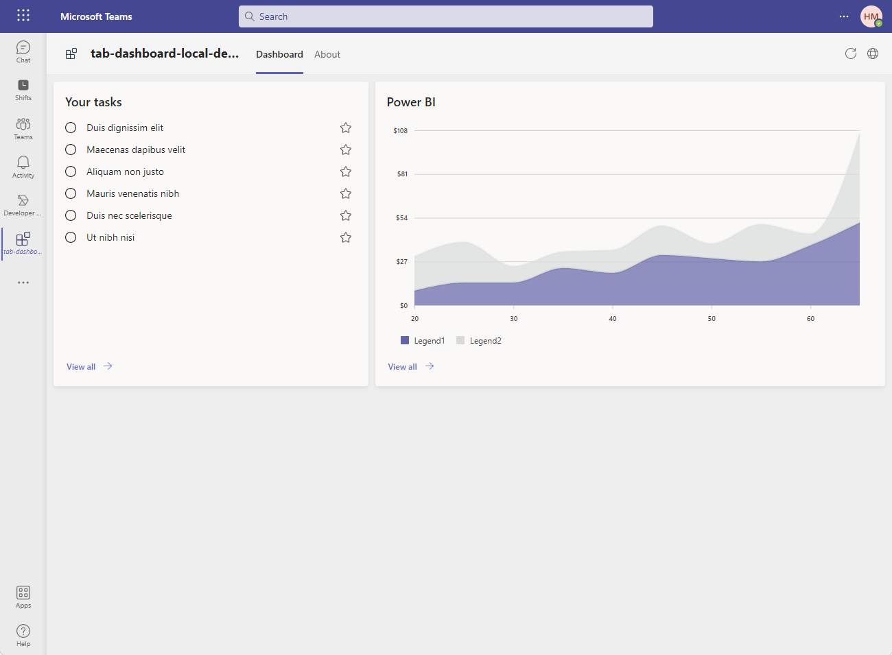
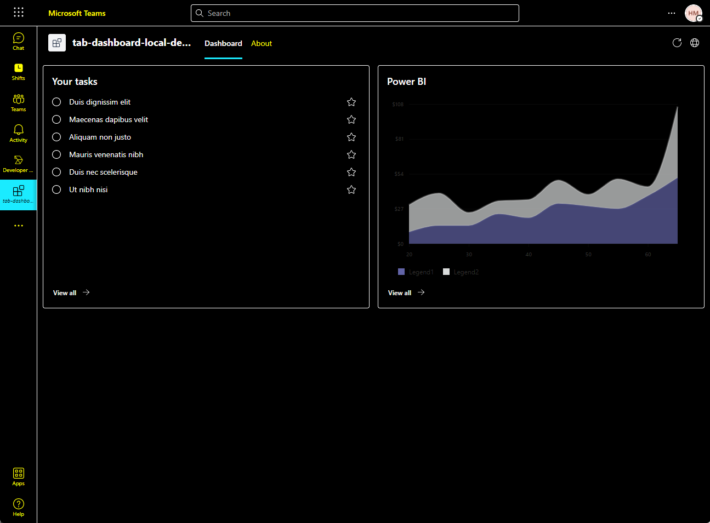

# Introduction

This is a Teams tab dashboard app that uses the [Fluent UI Northstar](https://fluentsite.z22.web.core.windows.net/0.64.0/) and the [Microsoft Graph API](https://learn.microsoft.com/en-us/graph/use-the-api) to display a user's profile information and recent Teams activity.

|      Default theme       |        Dark theme         | High contrast theme |
| :----------------------: | :-----------------------: | :-------------------: |
|  |  |  |


# Getting Started

Run your app with local debugging by pressing `F5` in VSCode. Select `Debug (Edge)` or `Debug (Chrome)`.

**Congratulations**! You are running an application that can now show a dashboard in Teams.

> **Prerequisites**
>
> To run locally, you will need:
>
> - [NodeJS](https://nodejs.org/en/), fully tested on NodeJS 14, 16
> - A Microsoft 365 account. If you do not have Microsoft 365 account, apply one from [Microsoft 365 developer program](https://developer.microsoft.com/en-us/microsoft-365/dev-program)
> - [Teams Toolkit Visual Studio Code Extension](https://aka.ms/teams-toolkit) or [TeamsFx CLI](https://aka.ms/teamsfx-cli)
>
> **Note**
>
> Your app can be installed into a team, or a group chat, or as personal app. See [Installation and Uninstallation](https://aka.ms/teamsfx-command-response#customize-installation).

# Understanding the code

This section walks through the generated code. The project folder contains the following:

| Folder      | Contents                                                                          |
| ----------- | --------------------------------------------------------------------------------- |
| `.fx`       | Project level settings, configurations, and environment information               |
| `.vscode`   | VSCode files for local debug                                                      |
| `tabs`      | The source code for the dashboard tab Teams application                           |
| `templates` | Templates for the Teams application manifest and for provisioning Azure resources |

The core dashboard implementation is in `tabs` folder.

The following files provide the business logic for the dashboard tab. These files can be updated to fit your business logic requirements. The default implementation provides a starting point to help you get started.

| File                              | Contents                             |
| --------------------------------- | ------------------------------------ |
| `src/index.ts`                    | Application entry point              |
| `src/components/sample/Task.tsx`  | A sample task widget implementation  |
| `src/components/sample/Chart.tsx` | A sample chart widget implementation |
| `src/components/Dashboard.css`    | The dashbaord style file             |
| `src/components/Dashboard.tsx`    | The implementation of dashboard      |
| `src/model/taskModel.ts`          | A model for the data in the widget   |

# How to add a new widget

To make it easier for you to add a widget, We provide some widget implementation examples under `src/components/sample` folder. You can copy any file and rename it, then update the `src/components/Dashboard.tsx` file to add the new widget to the dashboard.

For details, please refer to the following steps.

1. Copy a new JSX file from the `Task.tsx` file, and modify the file name and the class name.

2. Define a data model based on the business scenario, and replace the `TaskModel` in the your JSX file with the new data model just created.

3. Modify the `getData()` method in the widget JSX file to get data the widget needs. For example, you can call Graph API or something else.

4. Modify the `render()` method in the widget JSX file to render the widget.

   - Modify the `Card.Header` component to customize your widget header. For example, you can modify the `content` property to update the title of your widget. See [Card Header Props](https://fluentsite.z22.web.core.windows.net/0.64.0/components/card/props#card-header) and [Text Props](https://fluentsite.z22.web.core.windows.net/0.64.0/components/text/props) for more details.

   - Modify the `Card.Body` component to customize your widget body. See [Card Body Props](https://fluentsite.z22.web.core.windows.net/0.64.0/components/card/props#card-body) for more details. For more information about `Flex` layout, please refer to [Flex](https://fluentsite.z22.web.core.windows.net/0.64.0/components/flex/definition).

   - Modify the `Card.Footer` component to customize your widget footer. For example, you can align the footer to the right side by setting the `hAlign` property to `end`. For more information about `Button` style customization, please refer to [Button component definition](https://fluentsite.z22.web.core.windows.net/0.64.0/components/button/definition).
     ```tsx
     <Card.Footer fitted>
       <Flex hAlign="end">
         <Button
            text
            primary
            icon={<ArrowRightIcon" size="small" />}
            content="View all"
            iconPosition="after"
            size="small"
            style={{ width: "fit-content"}}
            onClick={() => {}}
        />
       </Flex>
     </Card.Footer>
     ```

5. Add the widget to the dashboard.

   - If you want to add the newly created widget to the same line as the sample widget, you can refer to the following code snippet.

     ```tsx
     <Flex column padding="padding.medium" gap="gap.medium">
       <Flex fill gap="gap.small">
         <Flex styles={{ flex: "1" }}>
           <Task />
         </Flex>
         <Flex styles={{ flex: "1" }}>
           <Chart />
         </Flex>
       </Flex>
     </Flex>
     ```

     `Task` and `Chart` are in the same line, they each occupy half width of the line. Forthermore, you can modify the `styles` property to change the width of the widget. For example, if you want to make `Chart` occupy 2/3 width of the line, you can modify the `styles` property to `styles={{ flex: "2" }}`.

   - If you want to add the newly created widget to a new line, you can refer to the following code snippet.

     ```tsx
     <Flex column padding="padding.medium" gap="gap.medium">
       <Flex fill gap="gap.small">
         <Flex styles={{ flex: "1" }}>
           <Task />
         </Flex>
       </Flex>
       <Flex fill gap="gap.small">
         <Flex styles={{ flex: "1" }}>
           <Chart />
         </Flex>
       </Flex>
     </Flex>
     ```

# How to add a new Graph API call

1. Consent scope first.

   You can call [`addNewScope(scopes: string[])`](/tabs/src/service/AddNewScopes.ts) to consent the scopes of permissions you want to add. And the consented status will be preserved in a global context [`FxContext`](/tabs/src/components/singletonContext.ts).

   You can refer to [the Graph API V1.0](https://learn.microsoft.com/en-us/graph/api/overview?view=graph-rest-1.0) to get the `scope name of the permission` related to the graph api you want to call.

2. Create a graph client by adding the scope related to the Graph API you want to call.

   You can refer to the following code snippet:

   ```ts
   let teamsfx: TeamsFx;
   teamsfx = FxContext.getInstance().getTeamsFx();
   const graphClient: Client = createMicrosoftGraphClient(teamsfx, scope);
   ```

3. Call the Graph API, and parse the response into a certain model, which will be used by front-end.

   You can refer to the following code snippet:

   ```ts
   try {
     const graphApiResult = await graphClient.api("<GRAPH_API_PATH>").get();
     // Parse the graphApiResult into a Model you defined, used by the front-end.
   } catch (e) {}
   ```

# See also

- [Fluent UI Northstar](https://fluentsite.z22.web.core.windows.net/0.64.0/)
- [Fluent UI React Charting Example](https://fluentuipr.z22.web.core.windows.net/heads/master/react-charting/demo/index.html#/)
- [Flex Layout](https://developer.mozilla.org/en-US/docs/Web/CSS/flex)
- [Dashboard sample](https://github.com/huimiu/DashboardDemo)
