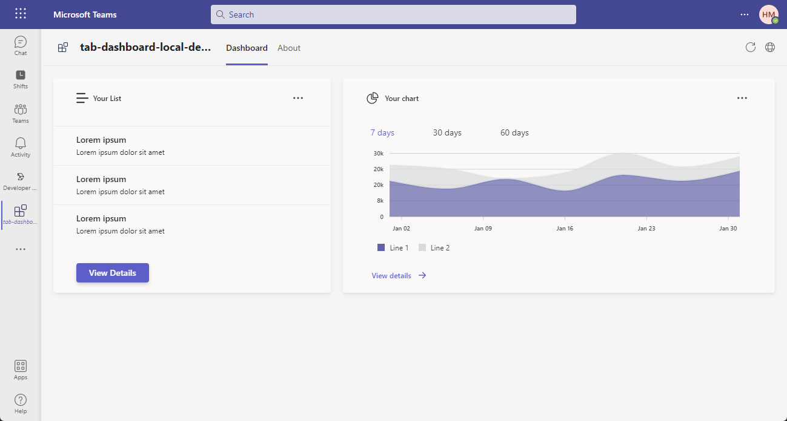

# Introduction

This is a Teams tab dashboard app that uses the [Fluent UI Northstar](https://fluentsite.z22.web.core.windows.net/0.64.0/) and the [Microsoft Graph API](https://learn.microsoft.com/en-us/graph/use-the-api) to display a user's profile information and recent Teams activity.



This app also supported teams different themes, including dark theme and high contrast theme.

|           Dark theme           |     High contrast theme      |
| :----------------------------: | :--------------------------: |
|  |  |

# Prerequisites

- [NodeJS](https://nodejs.org/en/), fully tested on NodeJS 14, 16
- A Microsoft 365 account. If you do not have Microsoft 365 account, apply one from [Microsoft 365 developer program](https://developer.microsoft.com/en-us/microsoft-365/dev-program)
- [Teams Toolkit Visual Studio Code Extension](https://aka.ms/teams-toolkit) or [TeamsFx CLI](https://aka.ms/teamsfx-cli)

# Getting Started

Run your app with local debugging by pressing `F5` in VSCode. Select `Debug (Edge)` or `Debug (Chrome)`.

**Congratulations**! You are running an application that can now show a dashboard in Teams.

# Understanding the code

This section walks through the generated code. The project folder contains the following:

| Folder      | Contents                                                                          |
| ----------- | --------------------------------------------------------------------------------- |
| `.fx`       | Project level settings, configurations, and environment information               |
| `.vscode`   | VSCode files for local debug                                                      |
| `tabs`      | The source code for the dashboard tab Teams application                           |
| `templates` | Templates for the Teams application manifest and for provisioning Azure resources |

The core dashboard implementation is in `tabs` folder.

The following files provide the business logic for the dashboard tab. These files can be updated to fit your business logic requirements. The default implementation provides a starting point to help you get started.

| File                                 | Contents                             |
| ------------------------------------ | ------------------------------------ |
| `src/views/Dashboard.css`            | The dashbaord style file             |
| `src/views/Dashboard.tsx`            | The implementation of dashboard      |
| `src/views/widgets/sampleWidget.tsx` | A sample widget implementation       |
| `src/models/sampleWidgetModel.tsx`   | Data model for the sample widget     |
| `src/services/sampleRequest.tsx`     | A sample data retrive implementation |

The following files are project-related files. You generally will not need to customize these files.

| File                                  | Contents                |
| ------------------------------------- | ----------------------- |
| `src/index.tsx`                       | Application entry point |
| `src/App.tsx`                         | Application route       |
| `src/middlewares/addNewScopes.ts`     |                         |
| `src/middlewares/context.ts`          |                         |
| `src/middlewares/login.ts`            |                         |
| `src/middlewares/singletonContext.ts` |                         |

# How to add a new widget

You can use the following steps to add a new widget to the dashboard:

1. [Step 1: Create a widget file](#step-1-create-a-widget-file)
2. [Step 2: Define the widget model](#step-2-define-the-widget-model)
3. [Step 3: Populate the widget model with data](#step-3-populate-the-widget-model-with-data)
4. [Step 4: Customize the widget view](#step-4-customize-the-widget-view)
5. [Step 5: Add the widget to the dashboard](#step-5-add-the-widget-to-the-dashboard)

## Step 1: Create a widget file

Create a JSX file under the `tabs/src/views/widgets` folder for your new widget, or you can just copy a new JSX file from the `tabs/src/views/widgets/SampleWidget.tsx` file, and modify the file name and the class name. Here's a sample widget file:

```tsx
import React from "react";
import SampleWidgetModel from "../../models/sampleWidgetModel";

interface IWidgetState {
  data?: SampleWidgetModel[];
}

export class Widget1 extends React.Component<{}, IWidgetState> {
  constructor(props: any) {
    super(props);
    this.state = { data: [] };
  }

  async componentDidMount() {
    this.setState({ data: getData() });
  }

  private getData(): SampleWidgetModel[] {
    ...
  }

  public render(): JSX.Element {
    return (
      <Card>
        ...
      </Card>
    );
  }
}
```

## Step 2: Define the widget model

Define a data model based on the business scenario, and put it in `tabs/src/models`, then replace the `SampleWidgetModel` in the your JSX file with the new data model just created.

The widget model defined according to the data you want to display in the widget. Here's a sample data model:

```typescript
export default interface WidgetModel1 {
  id: string;
  ...
}
```

## Step 3: Populate the widget model with data

Modify the `getData()` method in the widget JSX file to get data the widget needs. For example, you can call Graph API or something else.

## Step 4: Customize the widget view

Modify the `render()` method in the widget JSX file to customize the widget view.

```tsx
public render(): JSX.Element {
    return (
      <Card>
        <Card.Header>
          ...
        </Card.Header>

        <Card.Body>
          ...
        </Card.Body>

        <Card.Footer>
          ...
        </Card.Footer>
      </Card>
    );
  }
```

- Modify the `Card.Header` component to customize your widget header.
- Modify the `Card.Body` component to customize your widget body.
- Modify the `Card.Footer` component to customize your widget footer.

## Step 5: Add the widget to the dashboard

To add the widget to the dashboard.

1. Go to `tabs/src/views/Dashboard.tsx`
2. update your `render()` method to add the widget to the dashboard:

```tsx
render() {
  return (
    <>
      <div className="dashboard">
        ...
        <div className="row">
           ...        
           <div className="widget">
            <Widget1 />
          </div>
          ...
        </div>
        ...
      </div>
    </>
  );
}
```

# How to add a new Graph API call

There are two types of Graph APIs, one will be called from the front-end(most of APIs, use delegated permissions), the other will be called from the back-end(sendActivityNotification, e.g., use application permissions). You can refer to [this tutorial](https://learn.microsoft.com/en-us/graph/api/overview?view=graph-rest-beta) to check permission types of the Graph APIs you want to call.

## From the front-end(use delegated permissions)

If you want to call a Graph API from the front-end tab, you can refer to the following steps.

1. Consent delegated permissions first.

   You can call [`addNewScope(scopes: string[])`](/tabs/src/service/addNewScopes.ts) to consent the scopes of permissions you want to add. And the consented status will be preserved in a global context [`FxContext`](/tabs/src/components/singletonContext.ts).

   You can refer to [the Graph API V1.0](https://learn.microsoft.com/en-us/graph/api/overview?view=graph-rest-1.0) to get the `scope name of the permission` related to the Graph API you want to call.

2. Create a graph client by adding the scope related to the Graph API you want to call.

   You can refer to the following code snippet:

   ```ts
   let teamsfx: TeamsFx;
   teamsfx = FxContext.getInstance().getTeamsFx();
   const graphClient: Client = createMicrosoftGraphClient(teamsfx, scope);
   ```

3. Call the Graph API, and parse the response into a certain model, which will be used by front-end.

   You can refer to the following code snippet:

   ```ts
   try {
     const graphApiResult = await graphClient.api("<GRAPH_API_PATH>").get();
     // Parse the graphApiResult into a Model you defined, used by the front-end.
   } catch (e) {}
   ```

## From the back-end(use application permissions)

If you want to call a Graph API from the back-end, you can refer to the following steps. In this tutorial, we use `sendActivityNotification` API for example.

1. Consent application permissions first.

   Go to [Azure portal](https://portal.azure.com/) > Click `Azure Active Directory` > Click `App registrations` in the side bar > Click your Dashboard app > Click `API permissions` in the side bar > Click `+Add a permission` > Choose `Microsoft Graph` > Choose `Application permissions` > Find the permissions you need > Click `Add permissions` button in the bottom > Click `✔Grant admin consent for XXX` and then click `Yes` button to finish the admin consent

2. In the VS Code side bar, click `Add features` in `Teams Toolkit` > Choose `Azure functions` > Enter the function name

3. You should get the `installation id` of your Dashboard app.

   Go [Graph Explorer](https://developer.microsoft.com/en-us/graph/graph-explorer), and use the following api path to get a response.

   ```
   https://graph.microsoft.com/v1.0/users/{user-id | user-principal-name}/teamwork/installedApps?$expand=teamsAppDefinition
   ```

   In the response, you should find the information of your Dashboard app, and then record the `id` of it as `installationId`, which will be used in step 4.

   

4. In the `index.ts` under the folder named in step 2, you can add the following code snippet to call `sendActivityNotification`

   ```ts
   try {
     // do sth here, to call activity notification api
     //
     const graphClient_userId: Client = await createMicrosoftGraphClient(
       teamsfx,
       ["User.Read"]
     );
     const userIdRes = await graphClient_userId.api("/me").get();
     const userId = userIdRes["id"];
     // get installationId
     const installationId =
       "ZmYxMGY2MjgtYjJjMC00MzRmLTgzZmItNmY3MGZmZWEzNmFkIyMyM2NhNWVlMy1iYWVlLTRiMjItYTA0OC03YjkzZjk0MDRkMTE=";
     let postbody = {
       topic: {
         source: "entityUrl",
         value:
           "https://graph.microsoft.com/v1.0/users/" +
           userId +
           "/teamwork/installedApps/" +
           installationId,
       },
       activityType: "taskCreated",
       previewText: {
         content: "New Task Created",
       },
       templateParameters: [
         {
           name: "taskId",
           value: "12322",
         },
       ],
     };

     let teamsfx_app: TeamsFx;
     teamsfx_app = new TeamsFx(IdentityType.App);
     const graphClient: Client = createMicrosoftGraphClient(teamsfx_app, [
       ".default",
     ]);
     await graphClient
       .api("users/" + userId + "/teamwork/sendActivityNotification")
       .post(postbody);
   } catch (e) {
     console.log(e);
   }
   ```

5. Call the Azure Function from the front-end. You can refer to [this sample](https://github.com/OfficeDev/TeamsFx-Samples/blob/dev/hello-world-tab-with-backend/tabs/src/components/sample/AzureFunctions.tsx) for some helps.

# Additional resources

- [Fluent UI Northstar](https://fluentsite.z22.web.core.windows.net/0.64.0/)
- [Fluent UI React Charting Example](https://fluentuipr.z22.web.core.windows.net/heads/master/react-charting/demo/index.html#/)
- [Flex Layout](https://developer.mozilla.org/en-US/docs/Web/CSS/flex)
- [Button component definition](https://fluentsite.z22.web.core.windows.net/0.64.0/components/button/definition).
- [Dashboard sample](https://github.com/huimiu/DashboardDemo)
